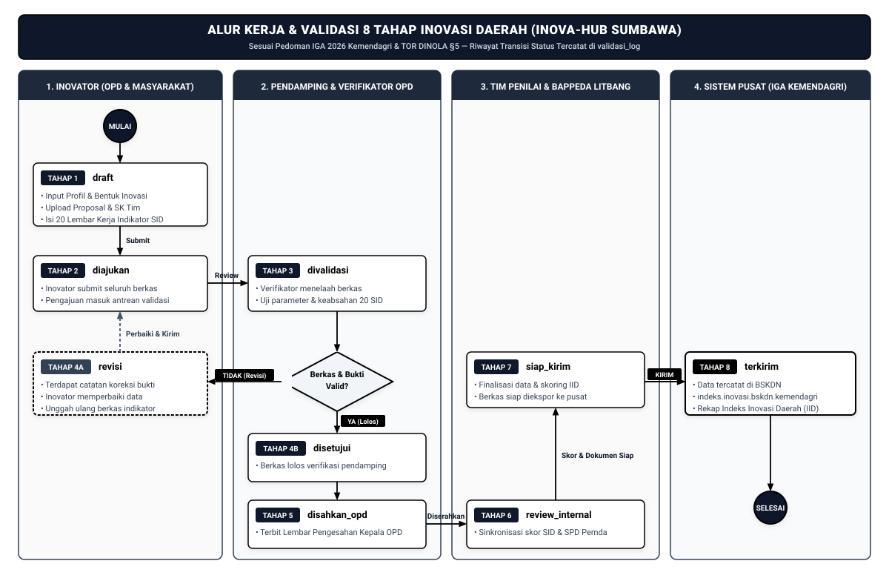
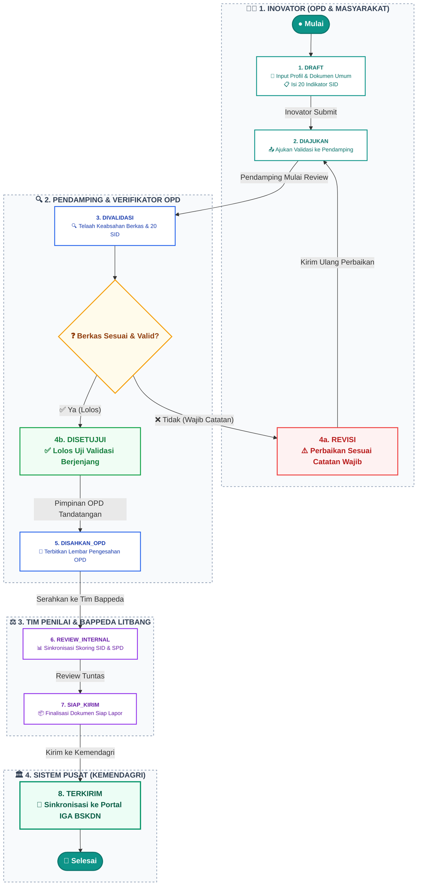
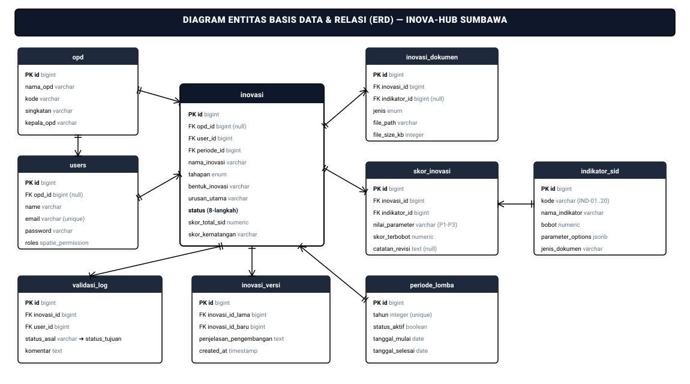
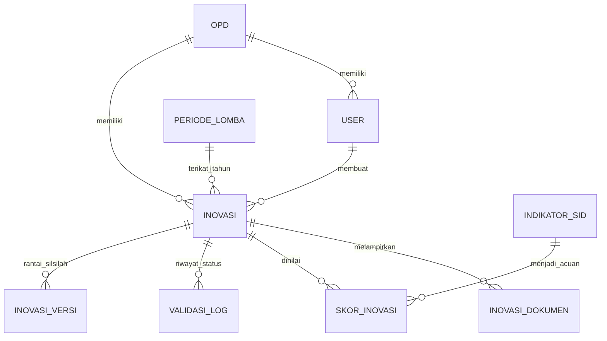

<div align="center">

<svg width="100" height="100" viewBox="0 0 100 100" fill="none" xmlns="http://www.w3.org/2000/svg">
  <circle cx="50" cy="50" r="48" fill="#0D9488" />
  <circle cx="50" cy="50" r="46" stroke="#5EEAD4" stroke-width="1.8" opacity="0.9" />
  <circle cx="50" cy="50" r="41" stroke="#FFFFFF" stroke-width="1" opacity="0.6" />
  <circle cx="50" cy="50" r="32" stroke="#FFFFFF" stroke-width="1" opacity="0.5" />
  <circle cx="50" cy="50" r="23" stroke="#FFFFFF" stroke-width="1" opacity="0.6" />
  <g transform="rotate(0 50 50)"><circle cx="50" cy="30" r="25" stroke="#FFFFFF" stroke-width="1.4" fill="none" opacity="0.85" /></g>
  <g transform="rotate(30 50 50)"><circle cx="50" cy="30" r="25" stroke="#FFFFFF" stroke-width="1.4" fill="none" opacity="0.85" /></g>
  <g transform="rotate(60 50 50)"><circle cx="50" cy="30" r="25" stroke="#FFFFFF" stroke-width="1.4" fill="none" opacity="0.85" /></g>
  <g transform="rotate(90 50 50)"><circle cx="50" cy="30" r="25" stroke="#FFFFFF" stroke-width="1.4" fill="none" opacity="0.85" /></g>
  <g transform="rotate(120 50 50)"><circle cx="50" cy="30" r="25" stroke="#FFFFFF" stroke-width="1.4" fill="none" opacity="0.85" /></g>
  <g transform="rotate(150 50 50)"><circle cx="50" cy="30" r="25" stroke="#FFFFFF" stroke-width="1.4" fill="none" opacity="0.85" /></g>
  <g transform="rotate(180 50 50)"><circle cx="50" cy="30" r="25" stroke="#FFFFFF" stroke-width="1.4" fill="none" opacity="0.85" /></g>
  <g transform="rotate(210 50 50)"><circle cx="50" cy="30" r="25" stroke="#FFFFFF" stroke-width="1.4" fill="none" opacity="0.85" /></g>
  <g transform="rotate(240 50 50)"><circle cx="50" cy="30" r="25" stroke="#FFFFFF" stroke-width="1.4" fill="none" opacity="0.85" /></g>
  <g transform="rotate(270 50 50)"><circle cx="50" cy="30" r="25" stroke="#FFFFFF" stroke-width="1.4" fill="none" opacity="0.85" /></g>
  <g transform="rotate(300 50 50)"><circle cx="50" cy="30" r="25" stroke="#FFFFFF" stroke-width="1.4" fill="none" opacity="0.85" /></g>
  <g transform="rotate(330 50 50)"><circle cx="50" cy="30" r="25" stroke="#FFFFFF" stroke-width="1.4" fill="none" opacity="0.85" /></g>
  <circle cx="50" cy="50" r="16" stroke="#5EEAD4" stroke-width="1.5" opacity="0.9" />
  <circle cx="50" cy="50" r="11" fill="#FFFFFF" />
</svg>

# **INOVA-HUB KABUPATEN SUMBAWA**
### *Platform Terpadu Pembinaan, Penilaian, dan Quality Assurance Inovasi Pelayanan Publik*
**Pemerintah Kabupaten Sumbawa — Bappeda Litbang**

[](https://laravel.com)
[](https://react.dev)
[](https://inertiajs.com)
[](https://www.typescriptlang.org)
[](https://www.postgresql.org)
[](https://tailwindcss.com)
[](https://ui.shadcn.com)

---
</div>

## 📑 Daftar Isi
1. [Penjelasan & Konsep Sistem (Explanation)](#-penjelasan--konsep-sistem-explanation)
   - [Latar Belakang & Urgensi](#latar-belakang--urgensi)
   - [Tujuan & Manfaat Strategis](#tujuan--manfaat-strategis)
   - [Arsitektur Quality Assurance (QA Layer)](#arsitektur-quality-assurance-qa-layer)
2. [Panduan Memulai Cepat (Tutorial / Quickstart)](#-panduan-memulai-cepat-tutorial--quickstart)
   - [Prasyarat Sistem](#prasyarat-sistem)
   - [Langkah Instalasi & Setup Lokal](#langkah-instalasi--setup-lokal)
   - [Menjalankan Server Aplikasi](#menjalankan-server-aplikasi)
   - [Kredensial Akun Bawaan (Demo Seeder)](#kredensial-akun-bawaan-demo-seeder)
3. [Panduan Operasional Pengguna (How-to Guides)](#-panduan-operasional-pengguna-how-to-guides)
   - [Panduan Peran Inovator (OPD & Masyarakat)](#1-panduan-peran-inovator-opd--masyarakat)
   - [Panduan Peran Pendamping / Verifikator](#2-panduan-peran-pendamping--verifikator)
   - [Panduan Peran Tim Penilai & Admin Bappeda](#3-panduan-peran-tim-penilai--admin-bappeda)
   - [Panduan Peran Pimpinan Daerah](#4-panduan-peran-pimpinan-daerah)
4. [Referensi Teknis & Spesifikasi (Reference)](#-referensi-teknis--spesifikasi-reference)
   - [Matriks Hak Akses Peran (RBAC)](#matriks-hak-akses-peran-rbac)
   - [Alur Status Validasi 8 Langkah (State Machine)](#alur-status-validasi-8-langkah-state-machine)
   - [Formula Skoring Matematis IGA 2026 (SPD, SID, IID)](#formula-skoring-matematis-iga-2026-spd-sid-iid)
   - [Katalog Matriks 20 Indikator SID & Bukti Dukung](#katalog-matriks-20-indikator-sid--bukti-dukung)
   - [Entitas Basis Data Utama & Relasi](#entitas-basis-data-utama--relasi)
   - [Katalog Rute Aplikasi (Route Map)](#katalog-rute-aplikasi-route-map)
   - [Konfigurasi Environment (.env Reference)](#konfigurasi-environment-env-reference)
5. [Standar Pengembangan & Pengujian Mutu](#-standar-pengembangan--pengujian-mutu)
6. [Troubleshooting & Solusi Masalah Umum](#-troubleshooting--solusi-masalah-umum)
7. [Dokumentasi Tambahan & Tautan Dokumen](#-dokumentasi-tambahan--tautan-dokumen)
8. [Lisensi & Identitas Resmi](#-lisensi--identitas-resmi)

---

## 💡 Penjelasan & Konsep Sistem (Explanation)

### Latar Belakang & Urgensi
Pemerintah Kabupaten Sumbawa berkomitmen mendorong budaya inovasi pelayanan publik dan tata kelola pemerintahan yang berkelanjutan (*Sabalong Samawa*). Setiap tahun, Kementerian Dalam Negeri menyelenggarakan **Innovative Government Award (IGA)** melalui Badan Strategi Kebijakan Dalam Negeri (BSKDN).

Dalam proses pelaporan ke sistem pusat (*indeks.inovasi.bskdn.kemendagri.go.id*), terdapat tantangan krusial di tingkat daerah:
- **Disparitas Kualitas Bukti Dukung**: Dokumen regulasi, SOP, SK tim, atau hasil evaluasi seringkali belum memenuhi kriteria skor maksimal (P3).
- **Ketiadaan Riwayat Koreksi Berjenjang**: Masukan dari tim teknis dan pimpinan OPD sulit terdokumentasi rapi tanpa audit trail.
- **Risiko Diskualifikasi Sistem Pusat**: Kesalahan input format atau berkas kadaluwarsa berpotensi menurunkan Indeks Inovasi Daerah (IID).

**INOVA-HUB** hadir sebagai solusi komprehensif untuk menjembatani dan menyelesaikan permasalahan tersebut.

```
┌─────────────────────────────────────────────────────────────────────────┐
│                       EKOSISTEM INOVASI SUMBAWA                         │
│                                                                         │
│   [ OPD & Masyarakat ]  ───►  [ INOVA-HUB (QA Layer) ]  ───► [ KEMENDAGRI ]│
│    • Input Inovasi              • Verifikasi Pendamping        • Laporan IGA│
│    • Upload 20 Indikator        • Skoring SID & SPD            • Indeks IID │
│    • Perbaikan Berkas           • Pengesahan Kepala OPD        • Peringkat  │
│                                 • Review Bappeda Litbang                    │
└─────────────────────────────────────────────────────────────────────────┘
```

### Tujuan & Manfaat Strategis
1. **Sentralisasi Repositori**: Menghimpun seluruh data dan berkas inovasi daerah ke dalam satu basis data transaksional PostgreSQL yang aman.
2. **Quality Assurance Pra-Pelaporan**: Memastikan seluruh berkas pendukung telah lolos kurasi sebelum batas waktu pelaporan nasional.
3. **Simulasi Skoring Real-Time**: Memberikan proyeksi skor kematangan inovasi dan estimasi nilai IID Kabupaten Sumbawa secara akurat.
4. **Siklus Hidup & Keberlanjutan (Arsip & Replikasi)**: Inovasi dari periode lomba sebelumnya diarsipkan secara read-only dan dapat diajukan kembali melalui skema pengembangan (*inovasi_versi*).

---

## ⚡ Panduan Memulai Cepat (Tutorial / Quickstart)

Panduan ini ditujukan bagi pengembang (*developer*) dan penguji (*evaluator*) yang ingin menginstal dan menjalankan INOVA-HUB pada lingkungan lokal.

### Prasyarat Sistem
Pastikan perangkat Anda memenuhi spesifikasi berikut:
- **PHP** $\ge 8.3$ dengan ekstensi: `pdo_pgsql`, `mbstring`, `openssl`, `tokenizer`, `xml`, `ctype`, `json`, `curl`, `fileinfo`, `gd`
- **Composer** $\ge 2.7$
- **Node.js** $\ge 20.x$ & **npm** $\ge 10.x$ (atau **pnpm**)
- **PostgreSQL Server** $\ge 15.x$ aktif di port `5432`

---

### Langkah Instalasi & Setup Lokal

#### 1. Kloning Repositori
```bash
git clone https://github.com/pemkab-sumbawa/repo-inovasi-daerah.git
cd repo-inovasi-daerah
```

#### 2. Instalasi Dependensi PHP & Node.js
```bash
# Instal dependensi backend Laravel
composer install

# Instal dependensi frontend React + TypeScript + shadcn/ui
npm install
```

#### 3. Konfigurasi Lingkungan (`.env`)
Salin berkas konfigurasi template:
```bash
cp .env.example .env
```
Buka berkas `.env` dan atur parameter PostgreSQL sesuai konfigurasi lokal Anda:
```ini
APP_NAME="INOVA-HUB Kabupaten Sumbawa"
APP_ENV=local
APP_KEY=
APP_DEBUG=true
APP_URL=http://localhost:8000

DB_CONNECTION=pgsql
DB_HOST=127.0.0.1
DB_PORT=5432
DB_DATABASE=repo_inovasi_sumbawa
DB_USERNAME=postgres
DB_PASSWORD=postgres
```

> [!IMPORTANT]
> Pastikan database dengan nama `repo_inovasi_sumbawa` sudah dibuat di server PostgreSQL Anda sebelum menjalankan migrasi.

#### 4. Generate Kunci Aplikasi & Tautan Berkas Storage
```bash
php artisan key:generate
php artisan storage:link
```

#### 5. Eksekusi Migrasi & Data Seeder
Jalankan migrasi skema tabel beserta data awal (Role, Akun Pengguna, Master OPD Sumbawa, dan 20 Indikator SID):
```bash
php artisan migrate:fresh --seed
```

---

### Menjalankan Server Aplikasi

Jalankan dua proses berikut pada terminal terpisah:

**Terminal 1 — Frontend Build Server (Vite HMR):**
```bash
npm run dev
```

**Terminal 2 — Backend Application Server (Laravel):**
```bash
php artisan serve
```

Aplikasi siap diakses di peramban web: **`http://localhost:8000`**

---

### Kredensial Akun Bawaan (Demo Seeder)

Semua akun pengujian berikut memiliki kata sandi bawaan: **`password`**

| Peran (Role) | Nama Pengguna | Alamat Email | Unit Kerja / OPD |
|---|---|---|---|
| **Pimpinan** | H. Mahmud Abdullah | `pimpinan@sumbawakab.go.id` | Pemerintah Kab. Sumbawa |
| **Tim Penilai** | Dr. H. Iskandar, M.Si | `tim_penilai@sumbawakab.go.id` | Bappeda Litbang Kab. Sumbawa |
| **Pendamping Utama** | Drs. Andi Wijaya, M.AP | `pendamping@sumbawakab.go.id` | Bappeda Litbang Kab. Sumbawa |
| **Pendamping Layanan** | Rina Rahmawati, S.STP | `pendamping2@sumbawakab.go.id` | Bappeda Litbang Kab. Sumbawa |
| **Inovator OPD 1** | Ahmad Fauzi, S.Kom | `inovator@sumbawakab.go.id` | Dinas Komunikasi dan Informatika |
| **Inovator OPD 2** | dr. Siti Maryam | `inovator2@sumbawakab.go.id` | Dinas Kesehatan |
| **Inovator OPD 3** | H. Suryadi, S.H. | `inovator3@sumbawakab.go.id` | Disdukcapil Kab. Sumbawa |
| **Inovator OPD 4** | Budi Santoso, S.Pd | `inovator4@sumbawakab.go.id` | Dinas Pendidikan dan Kebudayaan |
| **Inovator Masyarakat** | Fajar Saputra | `inovator5@sumbawakab.go.id` | Komunitas Sabalong Samawa |

---

## 🛠 Panduan Operasional Pengguna (How-to Guides)

### 1. Panduan Peran Inovator (OPD & Masyarakat)

#### A. Mendaftarkan Inovasi Baru
1. Masuk (*login*) menggunakan akun Inovator.
2. Buka menu **Inovasi Saya** (`/inovasi`) dan klik tombol **"Tambah Inovasi Baru"**.
3. Lengkapi formulir profil:
   - **Nama Inovasi**, **Tahapan** (Inisiatif/Uji Coba/Penerapan), **Bentuk Inovasi**, **Klasifikasi**, dan **Urusan Utama**.
   - Unggah berkas dokumen pendukung umum langsung pada formulir:
     - Berkas Proposal / Rancang Bangun (PDF)
     - Berkas Piagam / Sertifikat Penghargaan (opsional)
     - Tautan Video Dokumentasi YouTube (opsional)
4. Klik **"Simpan Data Inovasi"**. Status awal inovasi adalah `draft`.

#### B. Mengisi Lembar Kerja 20 Indikator SID
1. Pada tabel Inovasi Saya, klik ikon **Folder** pada kolom aksi atau buka halaman `/inovasi/{id}/indikator`.
2. Halaman indikator menyajikan progres bar pengisian dan simulasi skor kematangan di bagian atas.
3. Untuk setiap indikator (IND-01 s.d. IND-20):
   - Klik tombol **"Pilih Parameter"** pada kolom *Parameter*.
   - Pilih opsi parameter yang sesuai (P1, P2, P3, atau Tidak Dapat Diukur / 0) sesuai bukti dukung yang dimiliki.
   - Klik ikon **Folder Data Pendukung** pada kolom *Data Pendukung*.
   - Klik tombol **"Upload Dokumen Baru"** pada modal dialog untuk mengunggah berkas PDF bukti dukung resmi.
4. Setelah seluruh 20 indikator terisi dan dokumen lengkap, klik tombol **"Ajukan Validasi"** untuk mengirim berkas ke Pendamping (status berubah menjadi `diajukan`).

#### C. Melakukan Perbaikan Inovasi (Status `revisi`)
1. Jika status inovasi berubah menjadi `revisi`, buka halaman indikator.
2. Periksa badge catatan revisi berwarna merah/kuning pada indikator terkait.
3. Klik tombol **"Upload Dokumen Baru"** untuk mengganti atau menambahkan berkas perbaikan.
4. Klik tombol **"Kirim Ulang Revisi"** untuk mengajukan kembali ke pendamping.

#### D. Mengajukan Replikasi Inovasi dari Periode Lalu (Arsip)
1. Buka menu **Arsip Inovasi** (`/arsip`).
2. Pilih inovasi periode sebelumnya dan klik tombol **"Ajukan Kembali (Replikasi / Pengembangan)"**.
3. Isi kolom wajib **"Penjelasan Pengembangan / Pembaharuan"**.
4. Sistem akan otomatis menduplikasi data inovasi ke periode aktif dan membentuk rantai silsilah versi pada tabel `inovasi_versi`.

---

### 2. Panduan Peran Pendamping / Verifikator

#### A. Menelaah & Memverifikasi Berkas Inovasi
1. Masuk menggunakan akun Pendamping dan buka menu **Verifikasi Inovasi** (`/verifikasi`).
2. Klik inovasi berstatus `diajukan` untuk mulai memvalidasi (status otomatis berganti ke `divalidasi`).
3. Periksa setiap parameter dan berkas dokumen pendukung yang diunggah inovator menggunakan tombol **"Preview File"**.

#### B. Memberikan Hasil Verifikasi
- **Jika Terdapat Kekurangan**: Klik tombol **"Minta Revisi"**, lalu masukkan catatan koreksi spesifik per-indikator. Status inovasi berubah menjadi `revisi`.
- **Jika Berkas Sah & Lengkap**: Klik tombol **"Setujui Verifikasi"**. Status inovasi berubah menjadi `disetujui`.

#### C. Menerbitkan Pengesahan Kepala OPD
1. Pada inovasi berstatus `disetujui`, klik tombol **"Terbitkan Pengesahan OPD"**.
2. Unggah Surat Pengesahan / Lembar Verifikasi Bertandatangan Kepala OPD.
3. Klik simpan; status inovasi kini beralih menjadi `disahkan_opd`.

---

### 3. Panduan Peran Tim Penilai & Admin Bappeda

#### A. Review Internal & Sinkronisasi Skoring Akhir
1. Buka menu **Penilaian Inovasi** (`/penilaian`).
2. Pilih inovasi yang telah berstatus `disahkan_opd`.
3. Periksa kesesuaian skor simulasi SID dan SPD.
4. Klik tombol **"Mulai Review Internal"** (status menjadi `review_internal`).
5. Jika telah memenuhi kriteria pelaporan IGA, klik **"Tetapkan Siap Kirim"** (status menjadi `siap_kirim`).

#### B. Mencatat Histori Pengiriman ke Kemendagri
1. Setelah data disalin ke portal resmi IGA Kemendagri, buka menu penilaian.
2. Klik tombol **"Tandai Terkirim ke Kemendagri"**.
3. Masukkan ID Registrasi Pusat dan tanggal kirim. Status inovasi menjadi `terkirim`.

#### C. Pengelolaan Master Data Sistem
Tim Penilai memiliki hak akses penuh ke menu **Master Data** (`/master/*`):
- **Master Indikator**: Menyesuaikan bobot dan opsi parameter P1/P2/P3 tanpa perlu merubah kode (*zero-deployment*).
- **Master OPD**: Mengelola daftar Organisasi Perangkat Daerah dan unit kerja Kabupaten Sumbawa.
- **Master Linimasa & Periode Lomba**: Mengatur jadwal pembukaan, batas penginputan, batas validasi, dan penutupan periode kompetisi.

---

### 4. Panduan Peran Pimpinan Daerah

1. Masuk menggunakan akun Bupati / Wakil Bupati / Sekda.
2. Akses **Executive Dashboard** (`/dashboard`):
   - Pantau capaian **Indeks Inovasi Daerah (IID)** Kabupaten Sumbawa.
   - Amati distribusi inovasi berdasarkan kategori kematangan (*Sangat Inovatif*, *Inovatif*, *Kurang Inovatif*).
   - Tinjau grafik sebaran inovasi per OPD dan urusan pemerintahan.
   - Unduh ringkasan eksekutif laporan kematangan inovasi daerah.

---

## 📚 Referensi Teknis & Spesifikasi (Reference)

### Matriks Hak Akses Peran (RBAC)

| Modul / Kemampuan | Inovator | Pendamping | Tim Penilai | Pimpinan |
|---|:---:|:---:|:---:|:---:|
| Input Profil & Dokumen Umum Inovasi | ✅ | ❌ | ❌ | ❌ |
| Input Parameter & Bukti Dukung 20 SID | ✅ | ❌ | ❌ | ❌ |
| Submit Inovasi (`diajukan` / revisi) | ✅ | ❌ | ❌ | ❌ |
| Replikasi Inovasi dari Periode Arsip | ✅ | ❌ | ❌ | ❌ |
| Verifikasi Berkas & Catatan Revisi | ❌ | ✅ | ❌ | ❌ |
| Pengesahan Kepala OPD (`disahkan_opd`) | ❌ | ✅ | ❌ | ❌ |
| Review Internal Skoring Akhir | ❌ | ❌ | ✅ | ❌ |
| Penetapan Status `siap_kirim` & `terkirim` | ❌ | ❌ | ✅ | ❌ |
| Kelola Master Data (Bobot, OPD, Periode) | ❌ | ❌ | ✅ | ❌ |
| Monitoring Dashboard & Statistik IID | ❌ | ❌ | ✅ | ✅ (Read-Only) |

---

### Alur Status Validasi 8 Langkah (State Machine)

Transisi status bersifat ketat (*state-machine* berjenjang) dan seluruh riwayatnya dicatat secara otomatis pada tabel audit `validasi_log`.

<div align="center">



</div>

<details>
<summary>🔍 <b>Klik untuk melihat Diagram Interaktif Mermaid & Skrip Alur</b></summary>



</details>

---

---

### Formula Skoring Matematis IGA 2026 (SPD, SID, IID)

Penilaian kematangan mengacu pada **Petunjuk Teknis IGA 2026 Kemendagri**:

#### 1. Skor Satuan Pemda (SPD) — Bobot 30%
Mengukur kesiapan regulasi, kelembagaan, dan ekosistem inovasi pemerintah daerah:
$$\text{Skor SPD} = \left( \frac{\text{Skor Variabel Pengungkit} + \text{Skor Variabel Hasil}}{\text{Skor Maksimum SPD}} \right) \times 100$$

#### 2. Skor Satuan Inovasi Daerah (SID) — Bobot 70%
Mengukur kematangan teknis setiap inovasi berdasarkan 20 Indikator SID:
$$\text{Skor SID} = \sum_{i=1}^{20} (\text{Bobot}_i \times \text{Nilai Parameter}_i)$$

*Keterangan Nilai Parameter:*
- **P1** = Nilai 1 (Kesiapan dasar)
- **P2** = Nilai 2 (Kesiapan menengah)
- **P3** = Nilai 3 (Kesiapan paripurna / optimal)
- **0** = Tidak Dapat Diukur / Bukti Tidak Sesuai

#### 3. Simulasi Indeks Inovasi Daerah (IID)
$$\text{IID} = (0.30 \times \text{Skor SPD}) + \left(0.70 \times \frac{1}{N} \sum_{k=1}^{N} \text{Skor SID}_k\right)$$

*Tingkat Kematangan Inovasi:*
- **Sangat Inovatif**: Skor $\ge 80.00$
- **Inovatif**: $60.00 \le \text{Skor} < 80.00$
- **Kurang Inovatif**: $40.00 \le \text{Skor} < 60.00$
- **Tidak Dapat Dinilai**: Skor $< 40.00$

---

### Katalog Matriks 20 Indikator SID & Bukti Dukung

| Kode | Nama Indikator | Bobot | Parameter P1 / P2 / P3 | Jenis Bukti Dukung yang Sah |
|:---:|---|:---:|---|---|
| **IND-01** | Regulasi Inovasi Daerah | 3% | SK Kepala OPD (P1) / Perbup (P2) / Perda (P3) | Dokumen PDF Lembaran Daerah / Salinan SK Resmi |
| **IND-02** | Ketersediaan SDM Pengelola | 3% | Pengelola <3 Org (P1) / 3-5 Org (P2) / SK Tim Khusus + Bimtek (P3) | SK Tim Pelaksana / Sertifikat Pelatihan |
| **IND-03** | Dukungan Anggaran | 4% | <10 Juta (P1) / 10-50 Juta (P2) / >50 Juta di DPA (P3) | RKA / DPA-OPD Lembar Anggaran Terkait |
| **IND-04** | Penggunaan Infrastruktur TI | 5% | Manual-Digital (P1) / Semi-Otomatis (P2) / Full Web/App Cloud (P3) | Screenshot Sistem, URL Akses, Dokumen TI |
| **IND-05** | Kemudahan Proses Bisnis (SOP) | 5% | Ada Draf (P1) / SOP Ditetapkan (P2) / SOP Terintegrasi ISO/SPBE (P3) | Dokumen Standar Operasional Prosedur (SOP) |
| **IND-06** | Keterlibatan Aktor Inovasi | 5% | 1 Sektor (P1) / 2 Sektor (P2) / Pentahelix (P3) | Berita Acara Rapat, Foto Kegiatan, Notulensi |
| **IND-07** | Kecepatan Inovasi (Respon Time) | 6% | Pengurangan Waktu <25% (P1) / 25-50% (P2) / >50% Lebih Cepat (P3) | Standar Pelayanan & Rekapitulasi Waktu Layanan |
| **IND-08** | Kemanfaatan Inovasi | 7% | Manfaat Terbatas (P1) / Skala Kabupaten (P2) / Lintas Wilayah (P3) | Laporan Data Penerima Manfaat, Data Statistik |
| **IND-09** | Kepuasan Pengguna (IKM) | 6% | SKM Cukup (P1) / SKM Baik (P2) / SKM Sangat Baik >85 (P3) | Laporan Hasil Survei Kepuasan Masyarakat (SKM) |
| **IND-10** | Sosialisasi Inovasi | 4% | 1 Media (P1) / 2-3 Media (P2) / Media Cetak, Online & Lapangan (P3) | Kliping Berita, Foto Banner, Tautan Medsos |
| **IND-11** | Pedoman Teknis / Juknis | 4% | Ringkasan Alur (P1) / Petunjuk Singkat (P2) / Buku Manual Lengkap (P3) | Buku Manual Pengoperasian / Panduan Pengguna |
| **IND-12** | Kemudahan Akses Informasi | 4% | Informasi di Kantor (P1) / Website OPD (P2) / Portal Publik Terpadu (P3) | Link Publikasi / Tangkapan Layar Portal |
| **IND-13** | Kerjasama Antar Lembaga | 4% | Surat Dukungan (P1) / Nota Kesepakatan (P2) / PKS Bersama Stakeholder (P3) | Dokumen MoU / Perjanjian Kerja Sama (PKS) |
| **IND-14** | Replikasi Inovasi | 5% | Diminati (P1) / Proses Adopsi (P2) / Telah Direplikasi Pemda Lain (P3) | Surat Minat / Naskah Perjanjian Replikasi |
| **IND-15** | Integrasi Sistem Informasi | 6% | Standalone (P1) / Ekspor-Impor Data (P2) / Web Service API Terhubung (P3) | Arsitektur Interoperabilitas / Dokumentasi API |
| **IND-16** | Video Dokumentasi Inovasi | 6% | Durasi <2 Menit (P1) / 2-5 Menit (P2) / 2-5 Menit Standar Kemendagri (P3) | Tautan Video YouTube Publik Resolusi HD |
| **IND-17** | Penghargaan Inovasi | 4% | Tingkat Kab (P1) / Tingkat Provinsi (P2) / Tingkat Nasional/Internasional (P3) | Piagam Penghargaan / Sertifikat Pemenang |
| **IND-18** | Evaluasi Berkala | 5% | Tahunan (P1) / Semesteran (P2) / Triwulanan & Rekomendasi TL (P3) | Laporan Monitoring & Evaluasi Internal/Inspektorat |
| **IND-19** | Keberlanjutan Inovasi | 5% | Tercantum Renja (P1) / Renstra OPD (P2) / Masuk RPJMD & Regulasi Daerah (P3) | Dokumen Perencanaan Daerah Terkait Inovasi |
| **IND-20** | Kualitas Proposal Rancang Bangun | 5% | 5 Atribut Dasar (P1) / Lengkap 8 Atribut (P2) / Lengkap & Analisis Dampak (P3) | Naskah Proposal Rancang Bangun (Min 300 Kata) |

---

### Entitas Basis Data Utama & Relasi

Aplikasi menggunakan skema relasional PostgreSQL dengan integritas referensial:

<div align="center">



</div>

<details>
<summary>🔍 <b>Klik untuk melihat Skrip Relasi Mermaid ERD</b></summary>



</details>

- **`opd`**: Data Master Organisasi Perangkat Daerah Kabupaten Sumbawa.
- **`users`**: Akun pengguna terhubung dengan tabel peran Spatie RBAC.
- **`inovasi`**: Master data inovasi (tahapan, bentuk, urusan, nama, ringkasan, status 8-langkah).
- **`inovasi_dokumen`**: Berkas unggahan (proposal, SK, SOP, video) yang tersimpan di disk lokal.
- **`indikator_sid`**: 20 Indikator SID beserta bobot dan parameter P1/P2/P3.
- **`skor_inovasi`**: Nilai parameter dan catatan revisi per indikator.
- **`validasi_log`**: Log audit transisi status (user_id, status_asal, status_tujuan, komentar).
- **`inovasi_versi`**: Hubungan silsilah versi inovasi antar-periode (inovasi_id_lama ➔ inovasi_id_baru).
- **`periode_lomba`**: Master tahun lomba (status aktif vs arsip).

---

### Katalog Rute Aplikasi (Route Map)

| Jalur URL | Metode | Middleware Peran | Fungsi Antarmuka |
|---|:---:|---|---|
| `/` | `GET` | Guest / Auth | Landing page & portal pencarian inovasi publik |
| `/login` | `GET/POST` | Guest | Autentikasi sesi pengguna Fortify |
| `/dashboard` | `GET` | Auth | Dashboard ringkasan sesuai peran |
| `/inovasi` | `GET` | `role:inovator` | Indeks inovasi saya & tabel manajemen |
| `/inovasi/create` | `GET/POST` | `role:inovator` | Form input inovasi baru beserta upload berkas umum |
| `/inovasi/{id}/indikator` | `GET` | `role:inovator` | Lembar kerja 20 Indikator SID & simulasi skor |
| `/inovasi/{id}/indikator/{indId}/dokumen` | `POST/DELETE` | `role:inovator` | Manajemen upload berkas bukti dukung indikator |
| `/verifikasi` | `GET` | `role:pendamping` | Daftar antrean inovasi masuk untuk verifikasi |
| `/verifikasi/{id}` | `GET/POST` | `role:pendamping` | Layar pemeriksaan berkas, revisi & persetujuan |
| `/penilaian` | `GET` | `role:tim_penilai` | Modul skoring SPD/SID dan review internal |
| `/penilaian/{id}/kirim` | `POST` | `role:tim_penilai` | Finalisasi `siap_kirim` dan pencatatan `terkirim` |
| `/arsip` | `GET` | Auth | Galeri arsip inovasi periode sebelumnya |
| `/arsip/{id}/ajukan-lagi` | `POST` | `role:inovator` | Replikasi inovasi arsip ke periode berjalan |
| `/master/*` | `ANY` | `role:tim_penilai` | Pengelolaan Master Indikator, OPD, Linimasa, Periode |

---

### Konfigurasi Environment (`.env` Reference)

| Variabel | Tipe Data | Nilai Bawaan Lokal | Deskripsi |
|---|---|---|---|
| `APP_NAME` | String | `"INOVA-HUB Kabupaten Sumbawa"` | Nama aplikasi resmi |
| `APP_ENV` | String | `local` | Lingkungan (`local`, `staging`, `production`) |
| `APP_DEBUG` | Boolean | `true` | Debug bar & verbose error handling |
| `APP_URL` | URL | `http://localhost:8000` | URL utama akses aplikasi |
| `DB_CONNECTION` | String | `pgsql` | Driver database relasional |
| `DB_HOST` | Host | `127.0.0.1` | Alamat host PostgreSQL |
| `DB_PORT` | Integer | `5432` | Port layanan PostgreSQL |
| `DB_DATABASE` | String | `repo_inovasi_sumbawa` | Nama basis data |
| `DB_USERNAME` | String | `postgres` | Pengguna basis data |
| `DB_PASSWORD` | String | `postgres` | Kata sandi basis data |
| `FILESYSTEM_DISK` | String | `local` | Driver penyimpanan berkas (`local` / `public`) |
| `SESSION_DRIVER` | String | `database` | Driver sesi autentikasi pengguna |

---

## 🧪 Standar Pengembangan & Pengujian Mutu

Repositori ini menerapkan standar rekayasa perangkat lunak modern untuk menjaga integritas kode:

```bash
# 1. Menjalankan rangkaian unit & feature test PHPUnit
php artisan test

# 2. Menjalankan linter & code style formatter (Laravel Pint)
./vendor/bin/pint

# 3. Memverifikasi integritas tipe TypeScript tanpa kompilasi
npx tsc --noEmit

# 4. Melakukan kompilasi bundle aset frontend untuk produksi
npm run build
```

---

## ❓ Troubleshooting & Solusi Masalah Umum

### 1. Pesan Galat: `SQLSTATE[08006] [7/000] connection to server on "127.0.0.1", port 5432 failed`
- **Penyebab**: Server PostgreSQL lokal belum aktif atau port 5432 diblokir.
- **Solusi**: Pastikan service PostgreSQL telah berjalan (jika menggunakan Laragon, jalankan `start-pg.bat`, atau mulai via Windows Services: `services.msc` ➔ `postgresql-x64`).

### 2. Pesan Galat: `Vite manifest not found at: public/build/manifest.json`
- **Penyebab**: File build Vite belum dibuat atau Vite dev server belum dinyalakan.
- **Solusi**: Jalankan `npm run dev` pada terminal pendamping, atau jalankan `npm run build` untuk menghasilkan bundle statis.

### 3. Berkas Dokumen yang Diunggah Tidak Dapat Diunduh / 404
- **Penyebab**: Simbolis link penyimpanan Laravel belum dibuat.
- **Solusi**: Eksekusi perintah `php artisan storage:link` di terminal.

### 4. Cache Konfigurasi Tidak Memperbarui Nilai `.env`
- **Penyebab**: Laravel membaca konfigurasi yang di-cache.
- **Solusi**: Bersihkan cache dengan `php artisan optimize:clear` atau `php artisan config:clear`.

---

## 📖 Dokumentasi Tambahan & Tautan Dokumen

Tersedia dokumen spesifikasi teknis mendalam di direktori [`docs/`](file:///d:/CODE/repo-inovasi-daerah/docs):

- 📄 [**Product Requirements Document (PRD)**](file:///d:/CODE/repo-inovasi-daerah/docs/PRD.md) — Kebutuhan fungsional dan batasan sistem.
- 🏗 [**Arsitektur Sistem**](file:///d:/CODE/repo-inovasi-daerah/docs/architecture.md) — Desain komponen modul monolitik Laravel & Inertia.
- 🧮 [**Model Penilaian & Domain Bisnis**](file:///d:/CODE/repo-inovasi-daerah/docs/domain.md) — Glosarium lengkap dan detail skoring IGA 2026.
- 🗄 [**Skema Database & ERD**](file:///d:/CODE/repo-inovasi-daerah/docs/database.md) — Struktur tabel, indeks, dan relasi kunci asing.
- 🎨 [**Panduan UI & Antarmuka**](file:///d:/CODE/repo-inovasi-daerah/docs/ui-design.md) — Desain layout, palet teal Kemang Satange, dan aturan shadcn/ui.
- 📜 [**Term of Reference (TOR) Resmi**](file:///d:/CODE/repo-inovasi-daerah/TOR_DINOLA_Sumbawa.md) — Dokumen acuan TOR resmi Pemerintah Kabupaten Sumbawa.

---

## 🏛 Lisensi & Identitas Resmi

Hak Cipta &copy; 2026 **Pemerintah Kabupaten Sumbawa**.  
Dikelola dan dikembangkan oleh **Badan Perencanaan Pembangunan, Penelitian dan Pengembangan Daerah (Bappeda Litbang) Kabupaten Sumbawa**.

- **Alamat Kantor**: Jl. Garuda No. 1, Sumbawa Besar, Nusa Tenggara Barat, Indonesia
- **Email Resmi**: [bappeda@sumbawakab.go.id](mailto:bappeda@sumbawakab.go.id)
- **Portal Daerah**: [https://sumbawakab.go.id](https://sumbawakab.go.id)
- **Motto Pembangunan**: *"Sabalong Samawa — Bersama Membangun Inovasi Daerah"*
